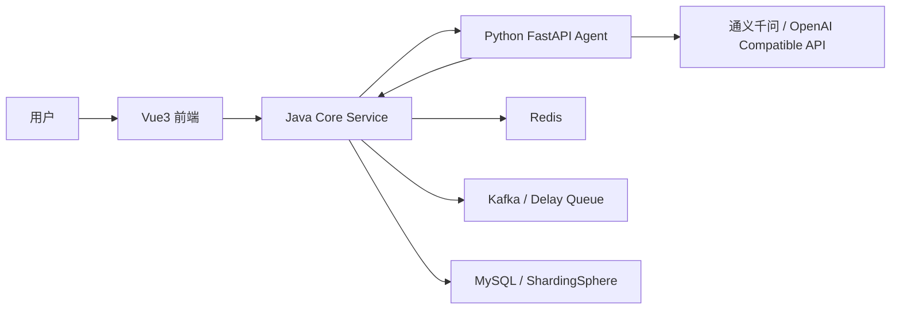

## 项目介绍
smart_life是“本地生活与商户运营”场景的综合实战项目，包含商户浏览与查询、优惠券发放与抢购、达人探店、好友关注、签到与 UV 统计等核心业务。围绕“高并发下的优惠券秒杀”与“热点查询”的真实问题，提供端到端的稳定性与一致性解决方案?
## 功能回顾
Smart Life AI Agent 是一个在传统本地生活服务平台基础上融合 AI Agent 的项目。项目保留原有的店铺、优惠券、秒杀、订单、Redis、Kafka、分库分表等后端能力，并新增本地生活导购 Agent，让用户可以通过自然语言完成找店、找券、订阅开抢提醒和券包管理。

**主要重点围绕 Redis 的多种数据结构与实战场景展开?*
这个项目的核心目标不是简单加一个聊天框，而是把 AI 融入真实业务链路：Agent 基于真实店铺、优惠券、评分、销量、订单和订阅状态进行推荐解释，Java 后端继续负责强一致业务和高并发交易链路。

- **短信登录?* 基于 Redis 共享 Session 实现分布式会话管理?- **商户查询缓存?* 认知并实战缓存穿透、缓存击穿、缓存雪崩问题的应对方式?- **优惠券秒杀?* 基于 Redis 计数?+ Lua 的原子扣减；理解分布式锁（含 Redisson）；掌握三种消息队列的用法与对比?- **附近的商户：** 使用 Redis GEO 实现地理位置检索与排序?- **UV 统计?* 使用 HyperLogLog 完成海量去重统计?- **用户签到?* 利用 BitMap 进行用户签到与统计?- **好友关注?* 基于 Set 实现关注、取消关注、共同关注等社交关系?- **达人探店?* ?List 实现点赞列表，用 SortedSet 实现点赞排行榜?
  **库存扣减相关功能**?
- 优惠券秒杀中的库存超卖问题与乐观锁方案?- Redis 分布式锁?Redisson 锁的选型与用法?- 使用 Redis 判断秒杀资格与消息队列的简单应用?
## 项目亮点

- **流量突发时，如何动态的限流?*
- **Redis宕机了怎么办？**
- **Redis数据丢失了怎么办？**
- **MQ宕机了怎么办？**
- **MQ消息丢失了怎么办？**
- **MQ消息延迟消费了怎么办？**
- **数据库的库存数量和Redis中的不一致怎么办？**
- **Redis恢复后，丢失的数据要怎么恢复?*
- **AI 导购 Agent**：支持自然语言找店、找优惠券、按预算/品类/场景推荐商家。
- **真实数据驱动推荐**：Agent 不直接编造答案，而是调用 Java 工具接口查询真实业务数据，再由大模型生成推荐理由。
- **Java + Python 分工清晰**：Java 负责业务系统和交易一致性，Python 负责 Agent 编排和大模型调用。
- **流式对话体验**：对话接口支持 SSE 流式输出，使用轻量模型提升首 token 响应速度。
- **优惠券订阅提醒**：用户可以订阅未来开抢的券，到点后收到站内通知。
- **保留原秒杀链路**：抢券仍由用户主动触发，继续走 Redis Lua、Kafka、订单落库和回滚对账链路。
- **我的券包与券提醒闭环**：抢券成功后进入券包，券提醒同步显示已领取状态。
- **Redis/DB 状态兜底**：当 Redis 订阅状态丢失时，通过 DB 有效订单恢复领取状态，避免券包和券提醒不一致。
## 系统架构

### Java 后端职责

- 🚦 **全链路流控：** 令牌前置授权 + 令牌桶限流，将“资格判断”与“流量控制”前置到入口，显著降低突发流量对系统的冲击?- 🗄?**多层缓存策略?* 本地缓存 + Redis 缓存 + 空值缓?+ 布隆过滤器，有效降低 DB 压力与热点击穿风险?- ?**缓存问题的完美解决：** 多层缓存与双重锁检测，辅以空值缓存与布隆过滤器，弥补普通版本的不足，彻底缓解穿透与击穿?- 🔁 **一致性闭环：** Redis 扣减、订单创建、消息投递、数据库落库之间建立明确的状态流转与补偿策略?- 📦 **MQ 可靠性：** 发布确认、重试退避、死信与延迟队列、消费幂等与去重，提升消息处理鲁棒性?- 🔍 **可观测与故障分析?* 聚焦链路瓶颈、异常源定位与版本压测对比，形成闭环优化机制?- 📈 **运营能力?* 支持“每?Top 买家”和“订?通知-领取”的活动玩法，提升用户参与度与复购?- 🗂?**分库分表与路由设计：** 分库分表与全局 ID 生成，订单与对账日志按需拆分，为数据规模增长与高并发写入提供保障?
  
- 用户登录、鉴权和用户上下文
- 店铺、博客、优惠券、秒杀券、订单等核心业务
- Redis 缓存、Lua 原子扣减、订阅集合、券状态缓存
- Kafka 秒杀下单异步消费、失败回滚和对账日志
- Redisson 延迟队列开抢提醒
- 我的券包、我的券提醒、站内通知
- 分库分表与订单路由

## 2.1 抢购业务的关键痛?
### Python Agent 职责

- **扣减链路缺少一致性闭?*
    - ⚠️ **问题?* Redis 扣减成功但订单创建失败、消息未投递或延迟，导致库表与缓存不一致?    - 🔹 **方案：Redis记录、本地消息表、订单对账日志、定时一致性校验与补偿队列，消费端幂等与去重?*
- 理解用户自然语言意图
- 规划工具调用，例如搜索店铺、查询优惠券、过滤有券商家、查询订阅状态
- 将真实业务数据组织给大模型
- 生成推荐理由、消费建议和对话回复
- 支持流式回复和模型降级兜底

- **MQ 可靠性不?*
    - ⚠️ **问题?* 使用 RedisStream，宕机后消息丢失，无发布确认、重试退避、延?死信队列，消息丢?重复/乱序未处理?    - 🔹 **方案：使?Kafka，并在生产端/消费端确认、指数退避重试、DLQ/延迟队列、消费幂等、发送失?消费失败/消费超时的各种处理?*
### Vue 前端职责

- **数据层扩展不?*
    - ⚠️ **问题?* 订单等热点数据未分库分表，大数量情况下性能低下，读扩散与热点聚集难抑制?    - 🔹 **方案：Sharding 路由、全局 ID 生成、分片内对账与差异补偿?*
- AI 导购对话页
- 店铺详情与抢券入口
- 订阅开抢提醒
- 我的券提醒
- 开抢通知
- 我的券包

- **故障场景处理缺失**
    - ⚠️ **问题?* Redis 主从切换数据丢失、Lua 宕机、扣减成功但订单失败 等没有对应的处理策略?    - 🔹 **方案：消息记录信息、操作日志记录、可重入脚本设计、补偿扫描与自动回滚机制?*
## 核心业务流程

## 2.2 扩展性的关键痛点

